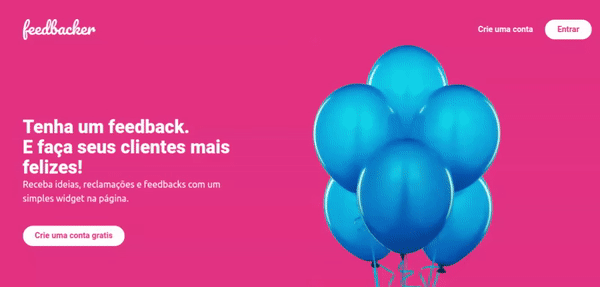

<p align="center">
   
</p>

<p align="center">	
   <a href="https://www.linkedin.com/in/AlexandreL0pes/">
      
   </a>
  
  <a href="https://github.com/AlexandreL0pes/feedbacker/commits/master">
    
  </a> 
  
  <a href="https://github.com/AlexandreL0pes/feedbacker/stargazers">
    
  </a>
</p>


> Projeto criado durante o maneiríssimo e gratuito [curso de Vue.js 3]([https://link](https://treinamento.vuejsbrasil.org/)) da [Vue.js Brasil](https://vuejsbrasil.org/).

# :pushpin: Table of Contents

<!-- * [Demo Website](#eyes-demo-website)    -->
- [:pushpin: Table of Contents](#pushpin-table-of-contents)
    - [Web Screenshot](#web-screenshot)
- [:computer: Technologies](#computer-technologies)
- [:rocket: Features](#rocket-features)
- [:construction_worker: How to run](#construction_worker-how-to-run)
    - [📦 Run API](#-run-api)
    - [💻 Run Web](#-run-web)
    - [📦 Run Tests](#-run-tests)
- [:closed_book: License](#closed_book-license)

<h2 align="left"> 📥 Layout available for download at: </h2>
<p align="center">
    <a title="Layout Web" href="https://www.figma.com/file/WhUZBnYnxgXVImQjh04Qon/Admin?node-id=0%3A1">
        
    </a>
    <a title="Layout Widget" href="https://www.figma.com/file/VYWmc92nrhSqrgUxf6QpFj/Widget">
        
    </a>
</p>

### Web Screenshot
<div align="center">
   
</div>
   
# :computer: Technologies
This project was made using the follow technologies:

* [Vue.js](https://vuejs.org/)
* [Tailwind CSS](https://tailwindcss.com/)
* [Cypress](https://www.cypress.io/)      
* [Docker](https://www.docker.com/)      

# :rocket: Features

* Service to get users feedbacks

# :construction_worker: How to run
```bash
# Clone Repository
$ git clone https://github.com/AlexandreL0pes/feedbacker.git
```
### 📦 Run API

```bash
# Build service
$ docker-compose build api

# Run service
$ docker-compose up api
```
Access API at http://localhost:3000/

### 💻 Run Web

```bash
# Build service
$ docker-compose build api

# Run service
$ docker-compose up front
```
Go to http://localhost:8080/ to see the result.

### 📦 Run Tests
For run unit tests, inside front container run 
```bash
# Run unit tests
$ yarn run test:unit
```

For run e2e tests, go to project root outside of services and run
```bash
# Run e2e tests
$ docker-compose run cypress

# Run e2e tests recording tests
docker-compose run -e CYPRESS_VIDEO=true cypress

# Run a single test
$ docker-compose run cypress cypress run --spec "integration/login.spec.js"
```


# :closed_book: License

Released in 2021 :closed_book: License

This project is under the [MIT license](./LICENSE).

Give a ⭐️ if this project helped you!
<div align="center">
  <sub>Built  by
    <a href="https://github.com/AlexandreL0pes">Alexandre Lopes</a>
  </sub>
</div>